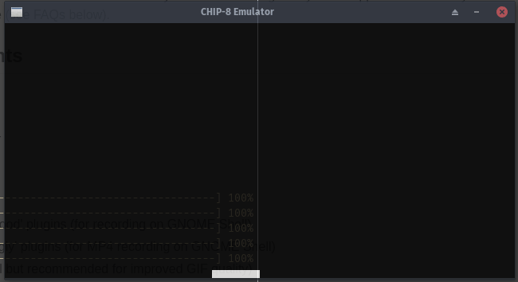
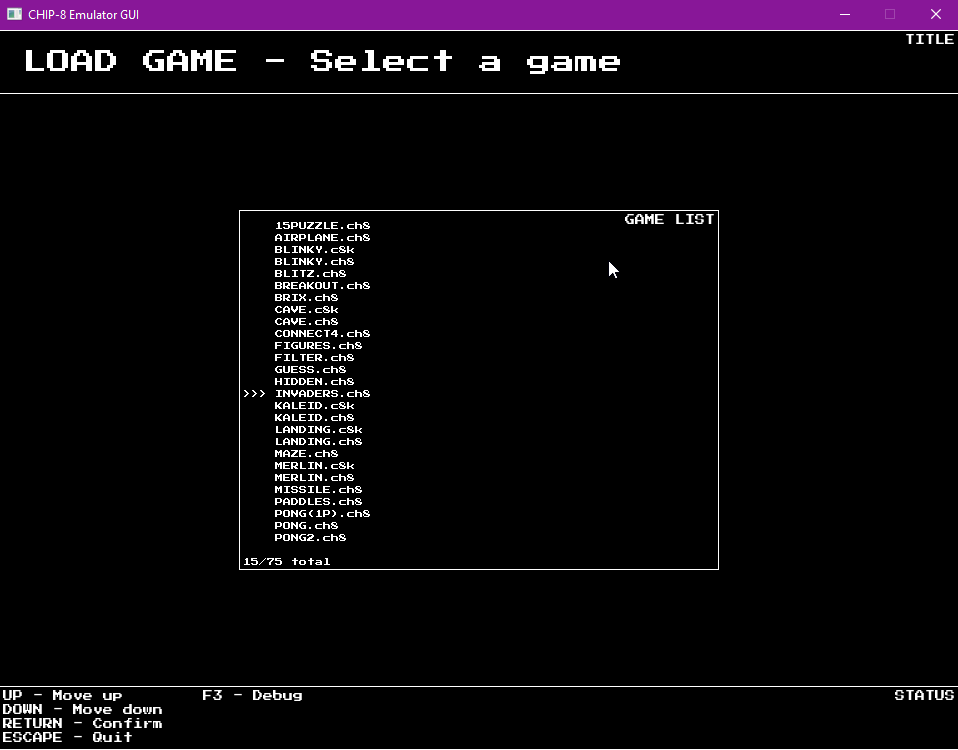

chip8
=====




Emulator project for the CHIP-8 virtual console written in Rust.  
This is for now my main project in Rust, and I try to experiment multiple things.

Windowing and rendering is done thanks to SDL2 and the rust-sdl2 wrapper.

Features
--------

- Support almost all CHIP-8 games
- CLI-driven mode to specifically use one functionality
- GUI-driven mode using a custom TUI-like frame system
- Game disassembler
- Game assembler
  - Write CHIP-8 assembly and build cartridges
- Save-state system
- Custom debugger
  - Terminal debugger with a GDB-like experience in CLI mode
  - Graphical debugger in GUI mode

Command-line help
-----------------

```
USAGE:
    chip8.exe [FLAGS] [OPTIONS] [--] [FILENAME]

FLAGS:
    -s, --break-at-start    add breakpoint at start
        --gui               GUI mode
    -h, --help              Prints help information
    -V, --version           Prints version information
    -v, --verbose           verbose mode

OPTIONS:
    -a, --assemble <OUTPUT>             assemble code
    -b, --breakpoint <breakpoint>...    add breakpoint at address
    -d, --disassemble <disassemble>     disassemble cartridge to file (use '-' to trace in console)
    -t, --trace <trace>                 trace execution to file

ARGS:
    <FILENAME>    cartridge path
```
