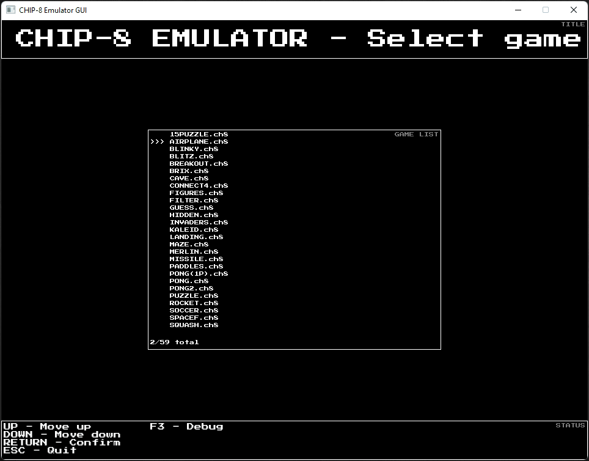

# CHIP-8 Emulator



Emulator project for the CHIP-8 virtual console written in Rust.

## Features

- Support almost all CHIP-8 games
- CLI-driven mode to specifically use one functionality
- GUI-driven mode using a custom TUI-like frame system
- Game disassembler
- Game assembler
  - Write CHIP-8 assembly and build cartridges
- Save-state system
- Custom debugger
  - Terminal debugger with a GDB-like experience in CLI mode
  - Graphical debugger in GUI mode

## Command-line help

### CLI application

**Command list**

```
Usage: chip8-cli <command> [<args>]

CHIP-8 Emulator CLI

Commands:
  play              play cartridge
  debug             debug cartridge
  assemble          assemble cartridge
  disassemble       disassemble cartridge
  version           show version
```

**Command: `play`**

```
Usage: chip8-cli play <file> [-t <trace>]

play cartridge

Options:
  -t, --trace       trace output file
```

**Command: `debug`**

```
Usage: chip8-cli debug <file> [-b <breakpoint...>]

debug cartridge

Options:
  -b, --breakpoint  add breakpoint at address
```

**Command: `assemble`**

```
Usage: chip8-cli assemble <source> <output>

assemble cartridge
```

**Command: `disassemble`**

```
Usage: chip8-cli disassemble <file> [-o <output>]

disassemble cartridge

Options:
  -o, --output      output file (omit argument for stdout)
```

### GUI application

```
Usage: chip8-gui.exe [<game_path>] [--debug]

CHIP-8 Emulator GUI

Options:
  --debug           use debug UI
```
